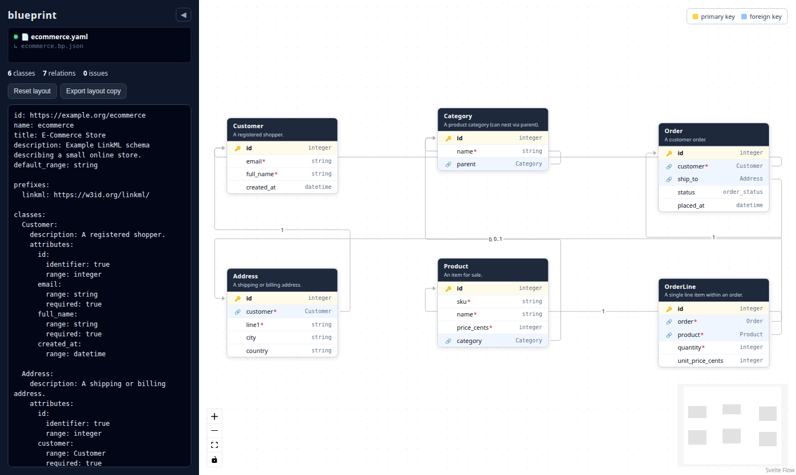

# blueprint

An infinite-canvas **ER diagram editor driven by [LinkML](https://linkml.io/)**.



Point it at a LinkML schema and blueprint paints an entity-relationship diagram —
one table per class, columns from slots, and edges for the foreign-key
relationships implied by slots whose range is another class. Tables can be
dragged around freely on an infinite canvas powered by
[Svelte Flow](https://svelteflow.dev/).

This is the same idea as [dbml](https://dbml.dbdiagram.io/) and its canvas, with
two deliberate differences:

- **LinkML is the source of truth** for _what_ to draw — no custom DSL.
- A **separate layout file** records _where_ to draw. The schema stays clean and
  authoritative while users rearrange the canvas; positions never leak back into
  the model.

## Stack

- [SvelteKit](https://svelte.dev/docs/kit) + Svelte 5 (runes), TypeScript
- [Bun](https://bun.com/) for tooling and package management
- [`@xyflow/svelte`](https://svelteflow.dev/) (Svelte Flow) for the canvas
- [`yaml`](https://www.npmjs.com/package/yaml) to parse LinkML

## CLI (`bp`)

The primary way to use blueprint is the `bp` command — point it at a LinkML file
and it opens that file in the canvas, no import/export needed:

```bash
bun install
bun link            # makes `bp` available on your PATH
bp mydb.yaml        # builds on first run, serves, opens the browser
```

Or without linking: `bun run bp mydb.yaml`.

In this **file-backed mode**:

- the schema is read from `mydb.yaml`;
- table positions autosave to a **neighbor file `mydb.bp.json`** as you drag;
- edits in the sidebar autosave back to `mydb.yaml` (when they parse cleanly);
- the server **watches both files** and pushes external changes to the canvas
  live (over SSE), so editing `mydb.yaml` in another editor updates the diagram
  — the app's own saves are suppressed so they don't echo back.

The schema stays the source of truth for _what_ to draw; `mydb.bp.json` only
holds _where_. Commit the schema, optionally commit the layout, ignore neither.

```
bp <schema.yaml> [--port 4321] [--no-open] [--rebuild]
```

## Browser mode (no CLI)

```bash
bun run dev        # http://localhost:5173
```

Run without `bp` and the app falls back to a bundled example, `localStorage` for
layout, and load/export buttons — so it still works as a pure browser app or
static deployment.

## Quality gates

```bash
bun test           # unit tests (Vitest)
bun run check      # type-check (svelte-check)
bun run lint       # prettier + eslint
bun run build      # production build
```

## How it works

| Concern                       | Module                                             |
| ----------------------------- | -------------------------------------------------- |
| Parse LinkML → ER model       | `src/lib/linkml/parse.ts`                          |
| ER model types                | `src/lib/linkml/types.ts`                          |
| Model + layout → flow graph   | `src/lib/linkml/toFlow.ts`                         |
| Layout persistence (browser)  | `src/lib/layout/store.ts`                          |
| Disk read/write (file-backed) | `src/lib/server/store.ts`                          |
| Neighbor path (`.bp.json`)    | `src/lib/server/paths.ts`                          |
| Schema/layout HTTP endpoints  | `src/routes/api/{schema,layout}/`                  |
| File watcher → SSE            | `src/lib/server/watch.ts`, `src/routes/api/watch/` |
| `bp` CLI launcher             | `bin/bp.js`                                        |
| Table node rendering          | `src/lib/components/TableNode.svelte`              |
| Canvas + editor               | `src/routes/+page.svelte`                          |

### LinkML subset supported

`classes` with inline `attributes` and/or referenced top-level `slots`,
reusable `slots`, `slot_usage` overrides, and `is_a` / `mixins` inheritance.
A slot is treated as a **foreign key** when its `range` matches another class
name; `identifier: true` (or `key: true`) marks the **primary key**.

## Issue tracking

This repo uses [Seeds](https://github.com/jayminwest/seeds) (`sd`) for git-native
issue tracking. Run `sd prime` for the workflow, `sd ready` to find work.
